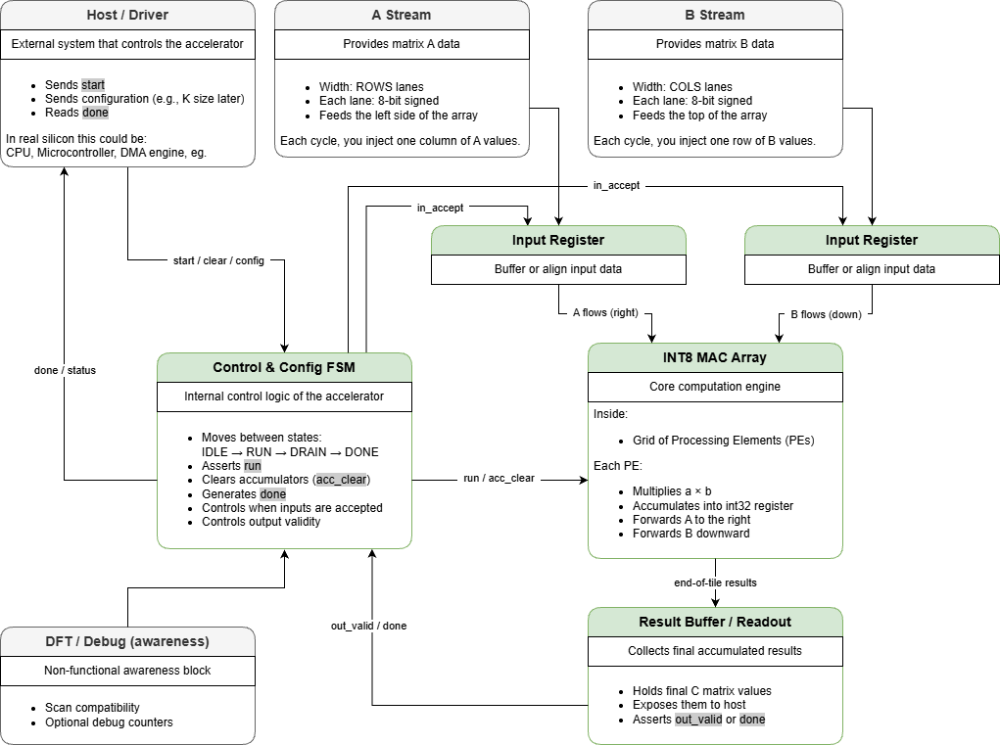

# Architecture Specification — INT8 MAC Array Accelerator
Version: 0.2  
Status: Draft (Pre-RTL)

---

# 1. System Overview

This accelerator implements a 2D systolic INT8 MAC array designed for matrix multiplication workloads.

Primary operation:

    C = A × B

Where:
- A is [M × K]
- B is [K × N]
- C is [M × N]

Each output element is computed as:

    C[i][j] = Σ (A[i][k] * B[k][j])

Accumulation is performed in INT32.

---

# 2. Compute Model

## 2.1 Data Types

| Signal | Type |
|--------|------|
| A input | int8 (signed) |
| B input | int8 (signed) |
| Product | int16 |
| Accumulator | int32 |

## 2.2 Overflow Policy

v0.2:
- Wrap-around arithmetic (default two’s complement)
- No saturation yet

Future version may support optional saturation.

---

# 3. Processing Element (PE)

Each PE contains:

- 8×8 signed multiplier
- 32-bit accumulator register
- Input forwarding registers
- Valid propagation logic

### PE Operation (per cycle)

If valid:
    acc <= acc + (a * b)

Data movement:
- `a` propagates horizontally (left → right)
- `b` propagates vertically (top → bottom)

---

# 4. Array Topology

## 4.1 Parameters

- ROWS (compile-time parameter)
- COLS (compile-time parameter)

Total MAC units:

    NUM_MAC = ROWS × COLS

## 4.2 Dataflow

Systolic-style:

Cycle t:
- New A elements enter column 0
- New B elements enter row 0
- Internal registers shift values across grid

Pipeline fill and drain latency expected.

---

# 5. Control Model

High-level FSM (conceptual):

- IDLE
- LOAD
- RUN
- DRAIN
- DONE

Precise FSM deferred until interface freeze.

---

# 6. External Interface (Conceptual)

## 6.1 Clock / Reset

- clk
- rst_n (active-low)

## 6.2 Inputs

- A_stream [ROWS lanes]
- B_stream [COLS lanes]
- in_valid
- start
- clear

### 6.2.1 Input Scheduling (Skew / Wavefront)

To ensure correct operand alignment across the 2D systolic array,
inputs must be provided as a skewed wavefront.

At cycle `t` (t = 0, 1, 2, ...), the boundary injections are defined as:

- `A_stream[i] = A[i, k]` where `k = t - i`
- `B_stream[j] = B[k, j]` where `k = t - j`

If `k` is out of range (`k < 0` or `k >= K`), that lane is treated as invalid for that cycle.

This scheduling guarantees that for any Processing Element `PE(i,j)`,
the operands corresponding to the same `k` arrive in the same cycle
after internal horizontal and vertical propagation.

### Assumption (v1.0)

Skew generation is handled externally by the feeder (host/DMA/testbench).
The accelerator assumes that incoming streams already follow the above schedule.

## 6.3 Outputs

- C_out [ROWS × COLS] (end-of-tile read)
- done
- out_valid

---

## 6.4 Interface v1.0 (Frozen)

The following interface and behavioral assumptions are frozen for v1.0 implementation.

### 6.4.1 Execution Model

- Fixed execution schedule (no backpressure)
- No ready/valid handshake in v1.0
- Inputs are consumed every cycle while `in_valid = 1`
- Total execution time:

  T_total = K + (ROWS - 1) + (COLS - 1)

---

### 6.4.2 Input Valid Policy

- Single global `in_valid` signal
- No per-lane valid signals in v1.0
- When a lane is out of range due to skew scheduling,
  the feeder must drive zero on that lane

---

### 6.4.3 Skew Responsibility

- Skew (wavefront scheduling) is handled externally by the feeder
  (Host / DMA / Testbench)
- The accelerator assumes incoming A_stream and B_stream
  follow the scheduling rule defined in Section 6.2.1

---

### 6.4.4 Output Policy

- Results are collected in the Output Buffer
- `out_valid` is asserted when the full C tile is ready
- `done` is equivalent to `out_valid` in v1.0

---

### 6.4.5 Clocking Assumption

- Single synchronous clock domain
- No clock gating in v1.0
- All state elements reset by `rst_n`

---

# 7. Performance Model

Theoretical peak throughput:

    MAC_per_cycle = ROWS × COLS
    Throughput = MAC_per_cycle × Fclk

Example:
    ROWS = 16
    COLS = 16
    Fclk = 500 MHz

    256 MAC/cycle
    128 GMAC/s

---

# 8. Verification Plan

## 8.1 Golden Model

Reference:
- Python model performing int8 matrix multiplication
- int32 accumulation

## 8.2 Test Categories

- Small deterministic cases
- Random matrices
- Max/min value stress
- Reset during run
- Back-to-back runs

Success criteria:
- Bit-exact output match
- No X-propagation
- Deterministic timing

---

# 9. Open Architectural Decisions

- Output read mechanism (parallel vs streaming)
- Handshake strict ready/valid vs fixed schedule
- Accumulator clear behavior
- Multi-tile scheduling

These must be resolved before RTL implementation.

---

# 10. Design-for-Test (DFT) Awareness

This accelerator is designed to remain compatible with standard silicon test methodologies.  
Full DFT implementation is out of scope for this project.

## 10.1 Scan Compatibility

- Single synchronous clock domain (v0.2 assumption)
- No gated clocks (use clock-enable instead)
- All sequential logic intended to remain scannable

Top-level scan ports may be added in future revisions:
- input logic scan_en;
- input logic scan_in;
- output logic scan_out;

These are placeholders only and are not functionally implemented.

---

## 10.2 Debug & Observability

Optional lightweight debug counters may be added in future versions:

- Cycle counter
- MAC operation counter
- Run-completion counter

These are intended for validation and performance visibility.

---

## 10.3 Reset Requirements

- Reset must deterministically clear accumulators
- No X-propagation after reset deassertion
- Test-related logic must not alter functional behavior when disabled
